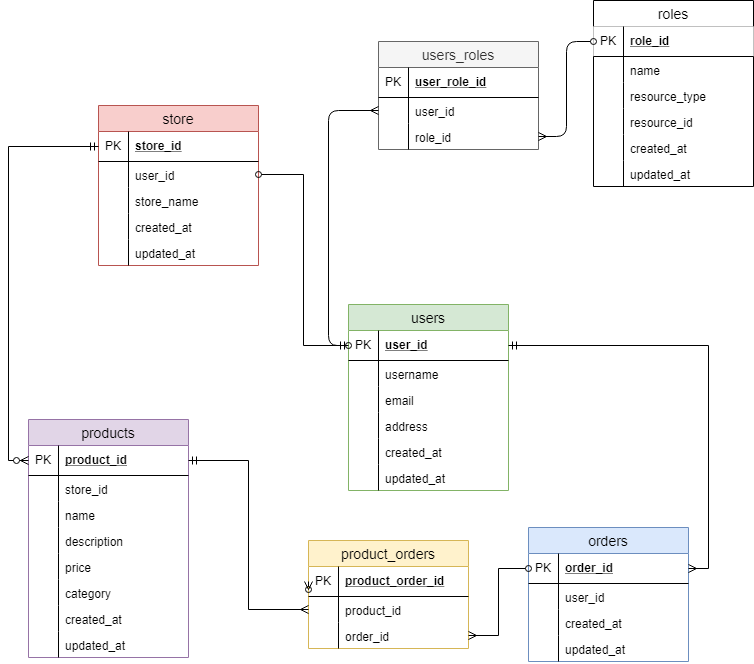
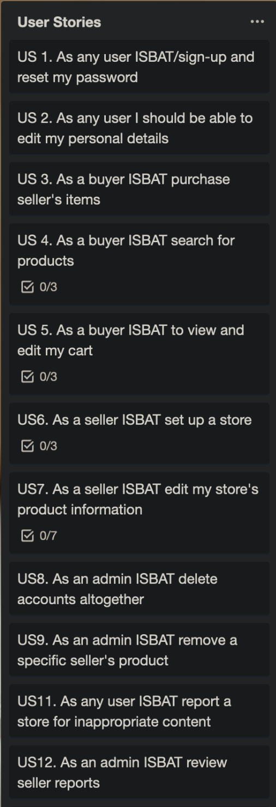
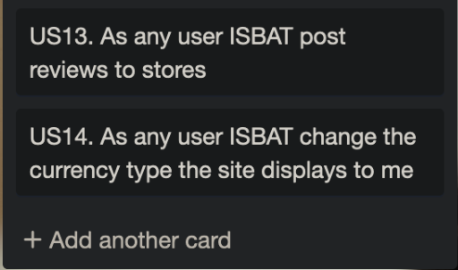

# Ruby on Rails Web App Project: Itzy

[App Link (Heroku)](https://www.heroku.com/carnivorous-raisin-4432)  
[Github Repo Link](https://github.com/Dylan-Speight/definitely_not_etsy/)

Ruby Version: 2.6.2

Rails Version: 5.2.3

## Project Description
### Problem Definition & Purpose

While Etsy and Ebay fill the 'User Store' marketplace, we identified them as being successful for different reasons. Ebay allows users to sell whatever they wanted with good search functionality to accomodate for it's broad scope. Etsy is focused more on user created items and craft goods, but with a much more appealing interface and design layout that makes it easy to use, and identify highly-rated products/stores.

We feel as though there is a gap in the market for an application that combines both of the traits of these highly successful websites. We set out to design a general purpose marketplace that was both fun and easy to navigate. We wanted users feel as though they were able to find what they were looking for easily, and find themselves interacting with more personal stores that something that you might find on Ebay, which feel more like retail outlets rather than real people.

### Functionality & Features

Our application allows any user to peruse products, although only authenticated users will be able to purchase products. Users can edit their view and edit their cart, and then pay for their order using Stripe as a third party for payment. Authenticated users can set up a store, and are able to define a category for their store, and provide a name (must be unique), and description for it. Store owners can create products for their store, with the ability to provide it an image, name, description, and price. Admins have permissions to delete users, stores, and products. The use case for allowing these permissions was determined to be for handling users/stores that are creating inappropriate products.

### Site Screenshots

### Tech Stack
We used Ruby on Rails as the framework for this application's development. The base for each page was built using HTML5 and styled using CSS (utilising SCSS). A minimal amount of Javascript was used to create the toggle functionality for the hamburger/user menus in the navigation bar. The application was deployed to Heroku. We called the Google Fonts API to import our font choice, 'Work Sans', and the Font Awesome CDN to utilise some groovy little icons throughout our web application.

### Instructions for App Use
WHAT FEATURES ARE AVAILABLE AND HOW TO USE THEM

## Design Documentation
### Design Process
Design choices // Accessability // Usability // Performance // Challenges (Should have utilised something like bootstrap/bulma - made reused all own elements and used significantly more time that would have + result wasn't as nice since no time to really refine it > Some user stories a bit limited in scope, didn't really take into account what it meant in rails to view store products - should have been view store, THEN view products in store, THEN add products to store)

### Workflow Diagram of the User Journey/s

### Database Entity Relationship Diagram

## Planning Process
### Project Plan

### Timeline

- Sprint 1 (29/04 > 01/05):

- Sprint 2 (02/05 > 04/05):  

- 05/05: Rest day

- Sprint 3 (06/05 > 08/05):  

- Sprint 4 (09/05 > 11/05):

- 12/05: Submission day, finalising documentation, finishing touches

### Trello Screenshots

Sprint 1:  

Sprint 2:  

Sprint 3:  

Sprint 4:  

Finished:  

## Short Answer Questions
### What is the need (i.e. challenge) that you will be addressing in your project?

See Problem Definition & Purpose

### Identify the problem you’re trying to solve by building this particular marketplace App? Why is it a problem that needs solving?

See Problem Definition & Purpose

### Describe the project will you be conducting and how your App will address the needs.

See Problem Definition & Purpose

### Describe the network infrastructure the App may be based on.

### Identify and describe the software to be used in your App.

### Identify the database to be used in your App and provide a justification for your choice.

### Identify and describe the production database setup (i.e. postgres instance).

### Describe the architecture of your App.

### Explain the different high-level components (abstractions) in your App.

### Detail any third party services that your App will use.

### Describe (in general terms) the data structure of marketplace apps that are similar to your own (e.g. eBay, Airbnb).

### Discuss the database relations to be implemented.

Could specify names for foreign keys but left as default (reference_id)

### Describe your project’s models in terms of the relationships (active record associations) they have with each other.

- User Model
    - devise  
        - FILL OUT DEVISE MODEL STUFF
    - has_one :store
        - A user can choose to have a store. has_one specifies a one-to-one relationship i.e. a user can only have one store. Without specific validation it allows the user to exist without any link to a store i.e. in this circumstance, a user can have a store, but does not have to.  
    - has_many :orders
        - A user can make many different product orders. This relationship enables users to access their own previous order details by pulling all order table entries referencing for that specific user_id  

- Store Model  
    - belongs_to :user
        - A store must belong to a user. For a entry to be created in the Store table, it must reference a user_id. This means a person visiting the site cannot create a store without first creating a regular user account. This provides a layer of authentication and prevents stores from easily being spam created.
    - has_many :products
        - A store can have many products. This relationship is relatively self-explanatory. Any store should be able to stock many different items. Any other relationship would not really make sense here.
    - has_many :store_orders
        - A store may have many different orders made from it.

### Provide your database schema design.

### Provide User stories for your App.

### Provide Wireframes for your App.

Mobile Home Page:

Tablet Home Page:

Desktop Home Page:

Desktop Store Page:

Desktop Product Page:

### Describe the way tasks are allocated and tracked in your project.

Tasks were allocated just through discussion with one another, each day deciding what we would work on from the list of tasks allocated for the current sprint. To ensure we were on the same page we then placed a "Person working on this task" label on the corresponding Trello card. While this may seem a bit redundant, we tried to simulate a real software development environment as possible, just to get comfortable with a workflow our future employers will likely have in place. Dylan tended to take tasks more related to the back-end of our application i.e. the controllers and their relationship with the models , while I took tasks with more front-end related elements i.e. views, and their relationship with the model.

### Discuss how Agile methodology is being implemented in your project.

We decided from the outset of this project that we would attempt to use a feature oriented, sprint-based approach to development. This was a new experience for both of us. We set up three day sprints during which we would try to get a certain set of features/user stories finished. The decision making process behind which features/user stories we assigned to each sprint took into account two factors. The first was total time; we didn't want to assign more work than we thought we could finish based on estimated time allotments for each task. The second was how that feature fit into the overall design of our product. We wanted to develop features in a way that would make sense allow the building process to flow smoothly i.e. we wanted users to be able to register and sign-in first before we worried about how they would edit their profile.

### Provide an overview and description of your Source control process.

We chose to use a feature branching workflow for this project. For each new feature/user story that we were addressing we 

### Provide an overview and description of your Testing process.

### Discuss and analyse requirements related to information system security.

### Discuss methods you will use to protect information and data.

### Research what your legal obligations are in relation to handling user data.

