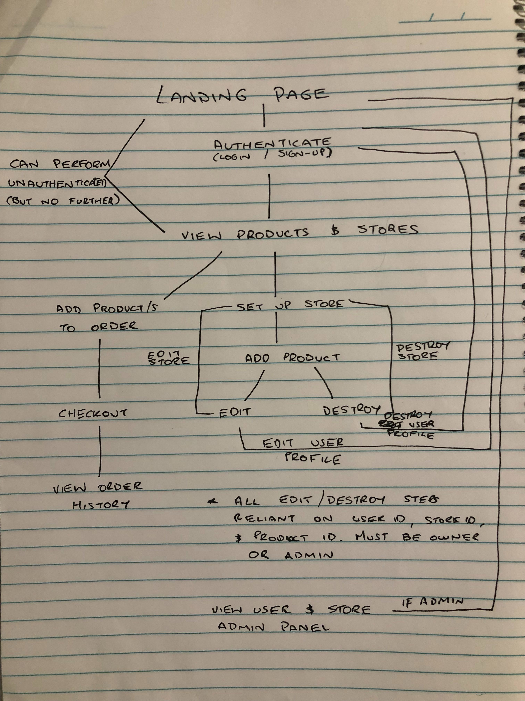

# Ruby on Rails Web App Project: Itzy

[App Link (Heroku)](https://carnivorous-raisin-4432.herokuapp.com)  
[Github Repo Link](https://github.com/Dylan-Speight/definitely_not_etsy/)

# Table of Contents
<!-- @import "[TOC]" {cmd="toc" depthFrom=1 depthTo=6 orderedList=false} -->

<!-- code_chunk_output -->

- [Ruby on Rails Web App Project: Itzy](#ruby-on-rails-web-app-project-itzy)
- [Table of Contents](#table-of-contents)
  - [Project Description](#project-description)
    - [Problem Definition & Purpose (SAQ 1-3)](#problem-definition--purpose-saq-1-3)
    - [Functionality & Features](#functionality--features)
    - [Site Screenshots](#site-screenshots)
    - [Tech Stack Rundown (SAQ 5 & 10)](#tech-stack-rundown-saq-5--10)
    - [Heroku - What Is It? (SAQ 4)](#heroku---what-is-it-saq-4)
    - [Heroku - Running a Database in the Cloud & DBMS Selection (SAQ 6 & 7)](#heroku---running-a-database-in-the-cloud--dbms-selection-saq-6--7)
    - [Instructions for App Use](#instructions-for-app-use)
  - [Design Documentation & Process](#design-documentation--process)
    - [Application Architecture (SAQ 8 & 9)](#application-architecture-saq-8--9)
    - [Workflow Diagram of the User Journey/s](#workflow-diagram-of-the-user-journeys)
    - [Database Design (SAQ 11-13)](#database-design-saq-11-13)
    - [Test Driven Development (SAQ 20)](#test-driven-development-saq-20)
    - [Future Development](#future-development)
  - [Planning Process](#planning-process)
    - [Timeline](#timeline)
    - [Project Plan](#project-plan)
    - [Entity Relationship Diagram/Database Design Planning (SAQ 14)](#entity-relationship-diagramdatabase-design-planning-saq-14)
    - [User Stories (SAQ 15)](#user-stories-saq-15)
    - [Wireframing (SAQ 16)](#wireframing-saq-16)
    - [Trello Screenshots](#trello-screenshots)
    - [Task Allocation (SAQ 17)](#task-allocation-saq-17)
    - [Agile Methodology (SAQ 18)](#agile-methodology-saq-18)
    - [Source Control Process (SAQ 19)](#source-control-process-saq-19)
    - [Protecting User Data and Our Legal Obligations Regarding Information Security (SAQ 21-23)](#protecting-user-data-and-our-legal-obligations-regarding-information-security-saq-21-23)

<!-- /code_chunk_output -->


## Project Description
### Problem Definition & Purpose (SAQ 1-3)
*1. What is the need (i.e. challenge) that you will be addressing in your project?*  
*2. Identify the problem you’re trying to solve by building this particular marketplace App? Why is it a problem that needs solving?*  
*3. Describe the project will you be conducting and how your App will address the needs.*  

While Etsy and Ebay fill the 'User Store' marketplace, we identified them as being successful for different reasons and felt we could combine both of their successful traits. Ebay allows users to sell whatever they wanted with good search functionality to accomodate for it's broad scope. Etsy is focused more on user created items and craft goods, but with a much more appealing interface and design layout that makes it easy to use, and identify highly-rated products/stores.

We feel as though there is a gap in the market for an application that combines both of the traits of these highly successful websites. We set out to design a general purpose marketplace that was both fun and easy to navigate. We wanted users feel as though they were able to find what they were looking for easily, and find themselves interacting with more personal stores that something that you might find on Ebay, which feel more like retail outlets rather than real people.

### Functionality & Features

Our application allows any user to peruse products, although only authenticated users will be able to purchase products. Users can edit their view and edit their cart, and then pay for their order using Stripe as a third party for payment. Authenticated users can set up a store, and are able to define a category for their store, and provide a name, and description for it. Store owners can create products for their store, with the ability to provide it an image, name, description, and price. Admins have permissions to delete users, and stores through stylised, private administrator panels. The use case for allowing these permissions was determined to be for handling users/stores that are creating inappropriate products. The footer features a live counter of the current number of users, stores, and products the application currently has in it's database. This counter will only update on refresh, and is one of the drawbacks of using something like embedded Ruby over asynchronous Javascript that would update as the data in the back-end changed.

### Site Screenshots

**Home Page Pt. 1:**  


**Home Page Pt. 2:**  


**Example Store Page:**  


### Tech Stack Rundown (SAQ 5 & 10)
*5. Identify and describe the software to be used in your App.*  
*10. Detail any third party services that your App will use.*

We used Ruby on Rails (RoR) as the framework for this application's development. The base for each page was built using HTML5 and styled using CSS (utilising SCSS). A minimal amount of Javascript was used to create the toggle functionality for the hamburger/user menus in the navigation bar. The application was deployed to Heroku, a Platform as a Service provider, allowing us to build and run an application that exists in the cloud. We called the Google Fonts API to import our font choice, 'Work Sans', and the Font Awesome CDN to utilise some groovy little icons throughout our web application.

**Ruby Version:** 2.6.2

**Ruby on Rails Version:** 5.2.3

**Database:** PostgreSQL

**Gem Overview:**

*Bundler* - Gem management system. Enables easy gem install, update and dependency mangement capabilities.

*Devise* - User authentication. User account and session creation, password encryption and email reset functionality.

*Rolify* - User authorisation. Allows user role creation, and resource access allocation depending on user role id e.g. only admins can access user admin panel where account removal functionality resides.

*Dotenv* - Environment variable creation for development. Loads a .env file during rails server initialisation that holds sensitive information such as database passwords and API keys/secrets.

*RSpec* - A Domain Specific Language testing tool. Used to create tests that determine whether the HTML produced by both us as developers and helpers within RoR, functions as we expect it to.

*Cloudinary* - Cloud-based image and video management platform. Uploaded images are delivered through their personal CDN, allowing fast media load times regardless of user geolocation.

*Stripe* - Remote payment infrastructure. Payment solution stack, that takes transactions away from the scope of your web application, removing much of the liability that comes with handling sensitive information such as credit card details, and deals with the frustration of things like chargebacks. Encrypts user traffic, aligning with our model/approach to information security.

### Heroku - What Is It? (SAQ 4)
*4. Describe the network infrastructure the App may be based on.*

Heroku as mentioned above is a Platform as a Service (PaaS) which runs our application in the cloud, removing the need for us to be resource and run our own production environment (that is where end users will actually interact with the application).

Applications deployed to Heroku typically contain source code from a supported language (Heroku is a polyglot platform currently Ruby, Node.js, Java, Python, Clojure, Scala, Go and PHP), a description of any dependencies - i.e. as gems in our case - and a Procfile. A procfile is a list of process types which are named commands that we want to executed against our source code during deployment. Fortunately things are made easy for us, as Heroku is able to detect that we are running RoR, and will load our list of dependencies from our Gemfile, and removes the need for a Procfile by simply running Puma, the inbuilt ready-to-go out of the box Rails web server. More simply, an application is source code, bundled with a description of dependencies and a set of instructions on what to run in the source code.

Heroku enables source control by acting as a Git remote repository. We are able to push our code to Heroku instead of Github by slightly altering the normal Github push command and running: 

`$ git push heroku master`

The build mechanism Heroku runs when deploying web applications is different based on the language of the application. In the instance of RoR, will load the source code, retrieve the dependencies from the Gemfile, and generate any necessary files from the asset pipeline (a RoR framework compress and minify JavaScript, CSS, and image assets). This build mechanism assembles these components and generates what is known as a 'slug' - a pack of ready to run code with the instructions to run it. 

The slug contains a few other bits and pieces as well. These are the config variables and add-ons. Config variables (Heroku's .env file) are independent configurations that sit outside of the application source code, that contain sensitive information such as API secrets/passwords/keys and database passwords. These can be altered at any given point via the Command Line Interface or the application dashboard on the Heroku website. An add-on is a third-party cloud service that provides additional functionality to your build with easy integration. Our application did not use any add-ons outside of our PostgreSQL provision. 

Heroku enables easy build rollback through the implementation of build releases. A release is a combination of the the buildpack slug and the config variables. Whenever either is altered a new release is produced. A developer can at any time rollback their deployment to a previous release.

Once the slug has been built it is deployed to a 'lightwight, secure, virtual Unix container'. Think of this as a miniature file-system with your slug loaded on to it, that provides the production environment needed for our web application to actually run.

Dynos can run various different web and queue processes required by our web application, and allow a scalar approach to deployment, each with its own copy of your applications slug. New releases are always deployed to new dynos, preserving the formation of the previous releases' dynos, and killing the previously executing dynos.

Our web application runs on a free dyno which will sleep after periods of inactivity. It will be awakened by any incoming HTTP traffic, after a short delay. This suits an assessment style web deployment, but a real web application with regular end users would require another non-free dyno type.

Small one-off dynos can be run for simple input/output operations. This is useful for tasks such as running a shell linked to your web application, allowing you to execute temporary non-destructive/transformative commands such as accessing the console i.e. changes made on one of these IO dynos won't be reflected on your other dynos.

Dynamic scaling of dynos accomodate for the scaling needs of web applications e.g. increased web traffic as an application's user base grows.

Heroku also takes logs from all of the running dynos for your web application, through the Logplex, allowing developers access to information that may help in the debugging process, when having deployment or runtime issues.

### Heroku - Running a Database in the Cloud & DBMS Selection (SAQ 6 & 7) 
*6. Identify the database to be used in your App and provide a justification for your choice.*  
*7. Identify and describe the production database setup (i.e. postgres instance).*  

While there appears to be much debate across the web as to what database management solutions (DBMS) are the 'best' I think the more appropriate question is what is the most appropriate DBMS for our application. RoR is relatively DBMS agnostic, allowing the developer to select what they deem appropriate from the wide selection available to them. In years gone by PostgreSQL has been seen as a reliable but slightly slower alternative to mySQL, but supported transactions. This has seen a change in years with PostgreSQL speeding up, and mySQL now supporting transactions. PostgreSQL is very extensive in it's capabilities while mySQL was seen as a more simple but straightforward solution. Both are open-source solutions.

PostgreSQL was our choice of DBMS. I say choice, as it would likely have been our choice, but in reality deploying to Heroku forced us to use PostgreSQL, as it is their DBMS of choice. PostgreSQL would likely have been our choice as learning more a complicated but feature-rich applications tends to be a good time investment in the long run.

Heroku justifies their choice for three reasons: operational experience allowing them to develop useful runtime features, fantastic support and guidance from long-time use of one of the largest PostgreSQL fleets in the world, and easy management by minimising the amount of user database setup or maintenance. Sounds pretty good to me. A far more detailed description of the additional features they provide is available on their website @ https://www.heroku.com/postgres.

On deployment Heroku can detect a PostgreSQL development environment. If one is not present it will request one is created (at least this is the case for RoR). This database will not contain any data you have stored locally in your development database. You will need to provide it with its own data, whether that is manually through the application or via a seed file. The instance used for your production environment will be located on a Heroku server, closest to the region the application is deployed from.

Heroku provides a feature-rich database environment for developers, allowing them to run multiple Postgres instances for a single app, allowing database linking between applications, extensive logging, database health diagnosis, and local environment access to the database (provided users connect via SSL).

### Instructions for App Use
***NB: If you want to contribute please first fork the repo.***

Prerequisites: 
- PostgreSQL installation
- Bundler installed

If you would like to run our application locally you can make a local copy you can clone this repository through the command line using:

`$ git clone https://github.com/Dylan-Speight/definitely_not_etsy.git`

Inside of the directory that you cloned, while still in command line, type:

`bundle install`

Update the .env file with your database username and password, and Cloudinary/Stripe API information.

From inside of the directory run:

`rails db:setup`

and:

`rails s`

Then visit localhost:3000 and you should be ready to go!


## Design Documentation & Process
### Application Architecture (SAQ 8 & 9)
*8. Describe the architecture of your App.*  
*9. Explain the different high-level components (abstractions) in your App.*  

RoR is a Model, View, Controller (MVC) framework/architecture, which we subsequently employ in our web application. Generally speaking MVC is an application design paradigm frequently used in object-oriented programming. It is designed to allow user input and call upon data based on their interaction with the application. The mechanics of this take place within the three separate components of the MVC framework, that is the Model, the View, and the Controller, in a way that allows granular control of this process. Put simply:

- **The Model**
  - Handles the back-end data and relational logic (normalised relational database)
- **The Controller**
  - For handling the user's input from the user interface within the application
- **The View**
  - Represents the outcome of the input in a graphical way to the end-user

A typical flow through a MVC framework in RoR is as follows:

1. The client (via their browser) sends a request to the web application
2. The router determines which Controller and subsequent action handles user's request
3. The controller pulls the appropriate data from the corresponding Model to respond to the request and passes it onto the View
4. The View renders the information to the end-user

We applied the four typical CRUD (Create, Read, Update, Delete) functions via Rails inbuild scaffolding generator to help us handle the expected needs of our end-users for this project and build out the high-level components for our application.

These components were:

- **Users**
  - The primary audience of our website
  - Able to register and become authenticated
  - Able to edit personal information or delete account
  - All users can are by default buyers, able adding products to their orders
  - Can potentially be sellers if they chose to set up a store
  - Some users are admins, able to delete other users, stores, and products
- **Stores**
  - A user can have a store which allows them to sell products
  - Able to edit their store information
  - Can delete their store if they wish
- **Products**
  - The items that sellers have in their store
  - Have their own set of information including a product image
  - Can be removed or edited at any point
- **Orders**
  - The list of products that a user has selected to purchase
  - Allows users to view their history of previous orders

### Workflow Diagram of the User Journey/s




### Database Design (SAQ 11-13)
*11. Describe (in general terms) the data structure of marketplace apps that are similar to your own (e.g. eBay, Airbnb).*  
*12. Discuss the database relations to be implemented.*  
*13. Describe your project’s models in terms of the relationships (active record associations) they have with each other.*

**Etsy**

Etsy while likely having very similar in terms of high-level components Etsy obviously operates on a much larger scale than us, and may implement their category system with a Model structure of its own with each product referencing a specific category and/or subcategory. I imagine this probably helps them with database responsiveness and data classification for look at user trends/metrics. It is clear that they also have Users, each who can but do not necessarily have to have a store, each of which can have many products. Their models likely have many more columns for each entry, as they store much more information such as user reviews, shipping options for product sales, etc.

They also handle credit card information on site, so must have specific measures in place to carefully maintain this data in a safe and secure way.

One comment I found on StackOverflow from someone claiming to be an Etsy system administator discussed using sharding. Sharding is the process of splitting data across lots of different database servers. They have another set of database servers dedicated solely to indexing, helping them find data on the shards.


- *User Model*
  - devise  
    - Describes the attributes that Devise has with the User model. On a high-level these attributes are that they are able to register and authenticate, able to recover their password, allow their details to be remembered via cookie, and validatable.
  - has_one :store
    - A user can choose to have a store. has_one specifies a one-to-one relationship i.e. a user can only have one store. Without specific validation it allows the user to exist without any link to a store i.e. in this circumstance, a user can have a store, but does not have to.  
  - has_many :orders
    - A user can make many different product orders. This relationship enables users to access their own previous order details by pulling all order table entries referencing for that specific user_id    
- *Store Model*  
  - belongs_to :user
    - A store must belong to a user. For a entry to be created in the Store table, it must reference a user_id. This means a person visiting the site cannot create a store without first creating a regular user account. This provides a layer of authentication and prevents stores from easily being spam created.
  - has_many :products
    - A store can have many products. This relationship is relatively self-explanatory. Any store should be able to stock many different items. Any other relationship would not really make sense here.
- *Product Model*
  - belongs_to :store & validates :store_id, presence: true
    - A product must belong to a store. A guest user cannot create a identity-less product. validate :store_id will not allow product creation to proceed even if a guest user was somehow able to access the product creation (which routing should not allow them to do).
  - has_many :product_orders
    - Allows the same product_id to exist many times in the ProductOrder joining table. A product may be in many different orders, as you would expect many different users to be ordering the same product. If a user did not want more than one to be sold, we plan in future iterations to allow quantity of stock to be an entry in the Product table.
  - delegate :store_name, to :store
    - A small helper which changes the output of the .store method when called on a product. This will delegate that attribute from store_id to store_name, allowing us to easily call @product.store rather than @product.store_name and receive the stores name as output. This was only possible as we did not really need the store_id (the normal output from @product.store) in the view at all as an attribute of a given product's store.
  - has_one_attached :image
    - Lets the model to know to possibly (not definitely) expect an image in Active Storage. This relationship does not necessarily require an image to be attached, but in our instance one is forcibly put there. This maps sets up a one to one relationship between active_storage.service file and the Product model.
  - after_commit :has_image, on [:create, :update]
    - This object callback allows us to access the object being created or updated just prior to it bring saved. This specific callback checks the file after an object creation or update for an image attachment. Unless it finds an image attached it will add a default one from our asset pipeline. The associated helper method is shown below:
```
def has_image
    unless image.attached?
        self.image.attach(io: File.open(Rails.root.join('app', 'assets', 'images', 'placeholder.png')), filename: 'placeholder.png', content_type: 'image/png')
    end
end
``` 
- *Order Model*
  - has_one :user
    - An order must belong to a given user. An order should not be allowed to exist without assocation with someone purchasing said order.
  - has_many :store_orders
    - The other side of the StoreOrder joining table's relationship. An order should be allowed to have many different products. Without allowing many here an user would be limited to order a single product at a time.
- *ProductOrder Model*
    - RoR models do not allow for many to many relationships by default
    - To bypass this limitation we create many to many relationship by association via a joining table
    - Both ends of the many to many relationship reference the joining table model with a has_many relationship, as described in the respective model above.
    - Here we include a belongs_to for both models i.e. Product & Order to complete this relationship and connect the two Models with a many to many relationship.
- *Role Model*
  - has_and_belongs_to_many :users, :join_table => :users_roles 
    - Rolify creates its on UsersRoles table that contains the authorisation data for the User model. This appends that tables information to the User table object information and describes a relationship where a user may have and belong to set roles in the UserRoles table such as admin.
- *Common Among Models*
    - resourcify
      - Identifies the resource models that you wish Rolify roles applied to.

### Test Driven Development (SAQ 20)
*20. Provide an overview and description of your Testing process.*

Test Driven Development (TDD) is as a concept describes a development process whereby tests are created before the code that they are actually testing. This encourages developers to produce concise, elegant, and functinoal code that simply fulfils the requirements of their testing (which in turn describe their design requirements). 

RSpec is a Ruby testing tool that is frequently used within a TDD environment for production applications. RSpec tests equality between expected and actual runtime code outcomes through assertations. For example, when a user signs in, that they are actually authenticated and have a valid session. We chose RSpec as our testing solution for this assessment.

I created a RSpec shell script that when called from the RSpec folder with an appropriate test file path would run the file, print the output to terminal and also tee the output to a rspec.log file. This would allow us to easily collate the results of our testing process. The script was simple, so I've included it as a code block below:

```
if [ -z $1 ]; then
    echo Filepath not found, please use the correct format: ./rspec-logger-2.sh yourfilepath
    exit
fi

rspec $1 2>/dev/null | tee -a ./rspec.log
```
I also added some config settings to maintain the nicely coloured and formatted output rspec -f d prints to STDOUT:

```
RSpec.configure do |config|
    # Use color in STDOUT
    config.color = true

    # Use color not only in STDOUT but also in pagers and files
    config.tty = true
  
    # Use the specified formatter
    config.formatter = :documentation # :progress, :html,
                                      # :json, CustomFormatterClass
end 
```

Unfortunately due to time constraints and not employing TDD from the beginning we actually didn't even get to use either RSpec or this helper logging script. For us this was definitely the biggest regret we both had. It is clear that there are significant benefits to employing TDD, but without planning with it in mind from the we quickly fell into the trap of feeling as though we didn't have time to go back and retrospectively develop tests that accurately reflected the outcomes we wanted in our development. This is something that will be in the forefront of my mind going into our next project.

### Future Development

Unfortunately due to assessment deadlines we only really managed to reach MVP. In future iterations we would still like to implement:

- **Build and run tests.**
- Multi-page display for products with the ability to limit how many are on the page at once via a dropdown menu. Currently the products page just shows all current products stored in the database. This only works on a very small-scale such as our test environment. Load times would become huge with even a small-business scale database.
- Product category selection being a dropdown, and a set of categories defined by us as the developers, rather than users being asked describe the category of their product. 
- Learn and implement how to re-use User IDs after they have been destroyed, and properly remove them from the User table in the database. Currently destroyed users will still have an empty entry in the User Administrator Panel.
- Multi-image upload for a single product, allowing users to have a slideshow of images for their product on the product show page.
- We had trouble getting the search bar working on the home page. Would like to fix this up.
- Alter the database so that both username and store name are unique & add a search feature to the admin panels. This would make it easier for admins to identify a particular user/store they were looking for in the admin panel.
- Multi-factor authentication for an even more secure user experience.
- Implmentation of ImageMagick for image compression. Image size could become a big issue for performance without some sort of counter-measure such as ImageMagick.
- Learn and implement alt tags on all of the images that are sourced in embedded Ruby. 
- Implement alt text for all other img tags within the site's base HTML structure.
- Enable guest checkout. Currently only users that are signed in can buy products.

## Planning Process
### Timeline

- *Sprint 1 (29/04 > 01/05):*
  - Planning phase:
    - Application idea brainstorming
    - User Stories
    - ERD Design
    - Wireframing
  - Basic scaffolding

- *Sprint 2 (02/05 > 04/05):* 
  - Basic model and controller setup
  - RSpec and Devise setup
  - Nav and footer design
  - Basic HTML outline for home page and products page
  - Basic application styling

- *05/05:* 
  - Dylan and I took a break over the weekend during the middle of the project

- *Sprint 3 (06/05 > 08/05):*
  - Image upload
  - Editting of individual store and user profile information
  - Creating user flow for editting and viewing of pages
  - Controller based restrictions for those not logged in
  - Controller based restrictions on those signed in so they could not edit anyone's information other than their own  

- *Sprint 4 (09/05 > 11/05):*
  - Worked on getting cart functioning and allowing users to edit it
  - Began integrating Stripe with our website allowing users to buy products
  - Added Rolify and designed User and Store admin pages
  - Gave admins the ability to destroy stores and user accounts for the use case of inappropriate content in their stores. Did not allow them to edit profiles.

- *Submission Day (12/05):* 
  - Finalised project structure for assignment submission
  - Remaining questions for README answered
  - Final deployment to Heroku performed and checked for any remaining issues that may have been missed

### Project Plan

Going into this project we knew that planning was going to be important as an application has many more parts to it than a static page such as our portfolios. Database design, user stories, wireframing, and workflow style (agile methodology & source control process) were all going to be important elements to be successful in developing this project.

We first sat down to just get some basic high level application ideas on paper and settled on our 'User Store' style marketplace. 

 

From here we went on to create our User Stories, which then gave us the floorplan so to speak for our database design. We kne what information we needed to store, and how these tables of data were likely to be linked. Dylan went ahead and worked on the Entity Relationship Diagram (ERD), while I got started on the wireframing for the website. We came back together with these finished and made a Trello board outlining what we needed to get done. A more detailed outline of this process can be found in the following sections.

### Entity Relationship Diagram/Database Design Planning (SAQ 14)
*14.  Provide your database schema design.*


To facilitate image upload for products we emplyed Active Storage. While not displayed in this ERD,  image data that was associated with the Product model was stored with Cloudinary. Active Storage does sets up two tables in our PostgreSQL database, active_storage_blobs, and active_storage_attachments - neither of which are reflected in our ERD as they are not directly related to our higher level application components, they simply act as an intermediary allowing image attachment to individual products.

After declaring Cloudinary as a service in our config/storage.yml and setting our API cloud name/key/secret in our .env file (and in config vars on Heroku), we set our Rails.application.config.active_storage.service to Cloudinary, identifying it to Active Storage as the expected location to find these image files.

### User Stories (SAQ 15)
*15. Provide User stories for your App.*


### Wireframing (SAQ 16)
*16. Provide Wireframes for your App.*

**Mobile Home Page:**


**Tablet Home Page:**


**Desktop Home Page:**


**Desktop Store Page:**


**Desktop Product Page:**


### Trello Screenshots

Sprint 1:  


Sprint 2:  


Sprint 3:  


Sprint 4:  


Finished:  


### Task Allocation (SAQ 17)
*17. Describe the way tasks are allocated and tracked in your project.*

Tasks were allocated through discussion with one another, each day deciding what we would work on from the list of tasks allocated for the current sprint. To ensure we were on the same page we then placed a "Person working on this task" label on the corresponding Trello card. While this may seem a bit redundant with only two people collaborating on a project, we tried to simulate as real as software development environment as possible, just to get comfortable with one workflow our future employers may likely have in place. Dylan tended to take tasks more related to the back-end of our application i.e. the controllers and their relationship with the models , while I took tasks with more front-end related elements i.e. views, and their relationship with the model.

### Agile Methodology (SAQ 18)
*18. Discuss how Agile methodology is being implemented in your project.*

We decided from the outset of this project that we would attempt to use a feature oriented, sprint-based approach to development. This was a new experience for both of us. We set up three day sprints during which we would try to get a certain set of features/user stories finished. The decision making process behind which features/user stories we assigned to each sprint took into account two factors. The first was total time; we didn't want to assign more work than we thought we could finish based on estimated time allotments for each task. The second was how that feature fit into the overall design of our product. We wanted to develop features in a way that would make sense allow the building process to flow smoothly i.e. we wanted users to be able to register and sign-in first before we worried about how they would edit their profile.

We encountered two main problems attempting this methodology for the first time. The first was poor time estimation for task completion. We set tried to estimate the time each task would take us to complete and then assigned tasks to each sprint accordingly. More often than not, these tasks ended up taking much longer than expected to complete and this created a backlog of tasks moving into each subsequent sprint. On the bright side, was a good lesson in learning how long certain tasks can take depending on the problems you run into, we can use this knowledge moving forward to better plan projects.

The second was running into unexpected tasks/problems. This project taught us that there are often unforeseeable issues/bugs that you will inevitably run into throughout the duration of a project, such as Heroku deployment issues, or a bug you just can't seem to get past. The takeaway from this was to give each sprint a buffer of 'spare time' to allow for these complications. 

### Source Control Process (SAQ 19)
*19.  Provide an overview and description of your Source control process.*

We chose to use a feature branching workflow for this project. Dylan set up a Github repository after we finished our project planning and added me as a contributor. We then created feature branches for each new feature or task we had set out to complete according to our sprints & task allocation. It took us a little while to get used to collaboration, but by the end of the project it began to feel quite natural making a branch, making changes, pushing them up to Github, creating a pull request and getting your code reviewed, and then getting that branch merged into the master branch.

One issues we both ran into was that we would find ourselves naming branches too specifically and then working on multiple other things unrelated to the branch name. This problem could be solved in the future by either making more generally named branches, or being a little bit more strict with what work we are doing in that feature branch.

While we understand that it is normal practice to delete feature branches after a pull request has been merged we thought that it would be helpful to show our source control process by showing our pull request history over the course of the project. This screenshot can be seen below:


### Protecting User Data and Our Legal Obligations Regarding Information Security (SAQ 21-23)
*21. Discuss and analyse requirements related to information system security.*  
*22. Discuss methods you will use to protect information and data.*  
*23. Research what your legal obligations are in relation to handling user data.*

If an application is anything more than an a piece of assessment/hobby creation i.e. has real end-users, a myriad of considerations must be made for information security. A developer must handle both their legal obligations and user expectations. 

A user can reasonably expected to remain anonymous and have their data retained without any fear of it leaking or being deleted by a malicious actor who gained was somehow able to escalate their user priviledge. With this in mind we should have employed more than one admin role, with different levels of priviledge. Currently anyone with access to the administrative role could effectively manually destroy all users (including other admins), products, and stores. Rolify was an important addition to help mantain the integrity of data, as without it a user who may have bypassed routing through something like Rails directory traversal CVE from 2018 could potentially edit other users data including their store or product information.

Information security is something that must be taken completely seriously and so it was important for us to employ a specialised gem to handle user authentication i.e. Devise. Devise hashes each users password, which means even if someone had unauthorised access to our User database, they would not be able to see users plaintext passwords. 

Using external third-party services raise an important topic applicable to many different frameworks, and that is validation of dependent software. More and more lately there have been instances of supply chain poisoning, such as Bootstrap last month, and CCleaner last year. These services provide a potentially huge vector of attack for black hat hackers. Supply chain poisoning is when a malicious actor gets access to a trusted third-party service's deployment server, and injects malicious code into their source code. I ensured that I checked the lastest security news around all of the third-party services we used before adding them to our gemfile. It's not possible for all small packages, but it can also be advisable to check the source code of anything small enough to look over, although this is more important at an enterprise level when bringing in new software to your tech stack.

It would have been nice to implement multi-factor authentication as an additional layer of security. It is definitely something I would want to add to future iterations. I did not have time before the assessment deadline to investigate what was available in terms of Rails gems. This would prevent a lot of the credential spraying attacks that have become popular lately.

Handling credit card information remotely with Stripe creates far less of a headache for developers as no credit card information ever hits their server.

Good controller/routes.rb routing is important to help to ensure that users cannot reach places that they are not supposed to have access to, but as mentioned before Rolify does help mitigate this in the event that this happens.

The Australian Privacy Act of 1988 requires that websites post a privacy policy, and contain multiple privacy rights that users are entitled to such as, 'how data is collected, stored and with whom it can be disclosed.' Recently Australian legislation was passed that required companies have a method to grant federal agencies (provided they are granted access by a court) access to any encrypted information.

Any company that has European users must also abide by the General Data Protection Regulation in 2018, replacing Data Protection Directive. It is an extensive set of regulations but one of the primary tenants is that users must be able to have their data removed at their request.
