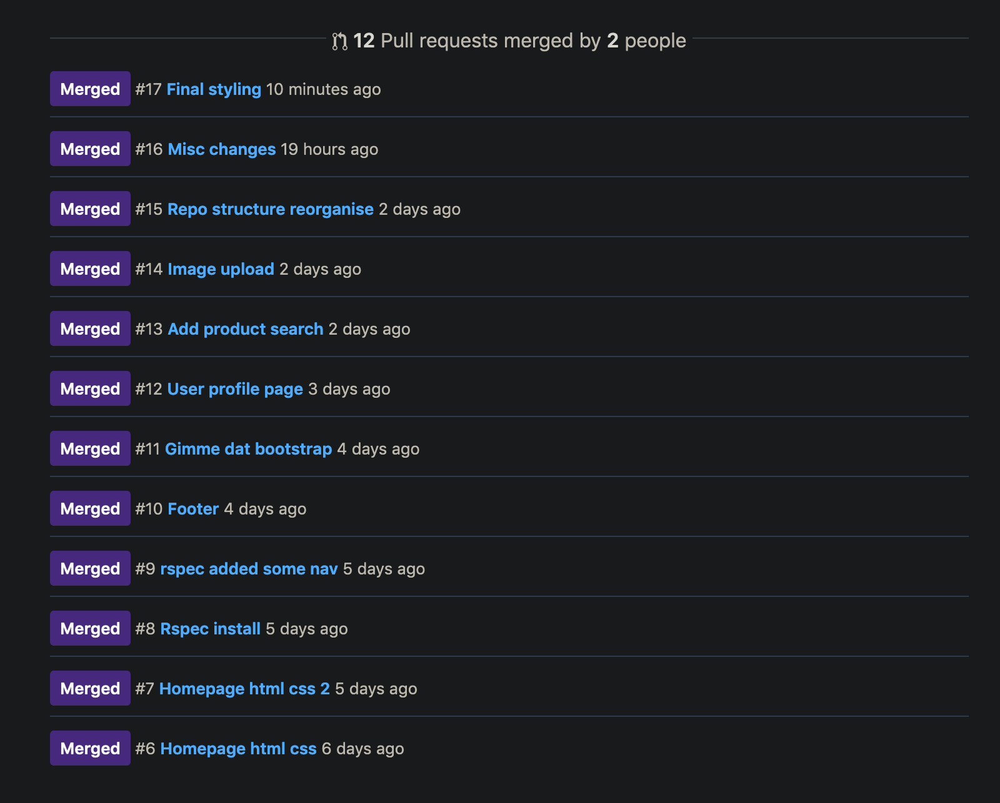

# Ruby on Rails Web App Project: Itzy

[App Link (Heroku)](https://www.heroku.com/carnivorous-raisin-4432)  
[Github Repo Link](https://github.com/Dylan-Speight/definitely_not_etsy/)

# Table of Contents
<!-- @import "[TOC]" {cmd="toc" depthFrom=1 depthTo=6 orderedList=false} -->

<!-- code_chunk_output -->

- [Ruby on Rails Web App Project: Itzy](#ruby-on-rails-web-app-project-itzy)
- [Table of Contents](#table-of-contents)
  - [Project Description](#project-description)
    - [Problem Definition & Purpose (SAQ 1-3)](#problem-definition--purpose-saq-1-3)
    - [Functionality & Features](#functionality--features)
    - [Site Screenshots](#site-screenshots)
    - [Tech Stack Rundown (SAQ 5 & 10)](#tech-stack-rundown-saq-5--10)
    - [Heroku - What Is It? (SAQ 4)](#heroku---what-is-it-saq-4)
    - [Heroku - Running a Database in the Cloud (SAQ 6 & 7)](#heroku---running-a-database-in-the-cloud-saq-6--7)
    - [Instructions for App Use](#instructions-for-app-use)
  - [Design Documentation](#design-documentation)
    - [Design Process](#design-process)
    - [Workflow Diagram of the User Journey/s](#workflow-diagram-of-the-user-journeys)
    - [Application Architecture (SAQ 8 & 9)](#application-architecture-saq-8--9)
    - [Database Design (SAQ 11-13)](#database-design-saq-11-13)
    - [Test Driven Development (SAQ 20)](#test-driven-development-saq-20)
    - [Future Development](#future-development)
  - [Planning Process](#planning-process)
    - [Timeline](#timeline)
    - [Project Plan](#project-plan)
    - [Entity Relationship Diagram/Database Design Planning (SAQ 14)](#entity-relationship-diagramdatabase-design-planning-saq-14)
    - [User Stories (SAQ 15)](#user-stories-saq-15)
    - [Wireframing (SAQ 16)](#wireframing-saq-16)
    - [Trello Screenshots](#trello-screenshots)
    - [Task Allocation (SAQ 17)](#task-allocation-saq-17)
    - [Agile Methodology (SAQ 18)](#agile-methodology-saq-18)
    - [Source Control Process (SAQ 19)](#source-control-process-saq-19)
    - [Protecting User Data and Our Legal Obligations Regarding Information Security (SAQ 21-23)](#protecting-user-data-and-our-legal-obligations-regarding-information-security-saq-21-23)

<!-- /code_chunk_output -->

## Project Description
### Problem Definition & Purpose (SAQ 1-3)
*1. What is the need (i.e. challenge) that you will be addressing in your project?*  
*2. Identify the problem you’re trying to solve by building this particular marketplace App? Why is it a problem that needs solving?*  
*3. Describe the project will you be conducting and how your App will address the needs.*  

While Etsy and Ebay fill the 'User Store' marketplace, we identified them as being successful for different reasons. Ebay allows users to sell whatever they wanted with good search functionality to accomodate for it's broad scope. Etsy is focused more on user created items and craft goods, but with a much more appealing interface and design layout that makes it easy to use, and identify highly-rated products/stores.

We feel as though there is a gap in the market for an application that combines both of the traits of these highly successful websites. We set out to design a general purpose marketplace that was both fun and easy to navigate. We wanted users feel as though they were able to find what they were looking for easily, and find themselves interacting with more personal stores that something that you might find on Ebay, which feel more like retail outlets rather than real people.

### Functionality & Features

Our application allows any user to peruse products, although only authenticated users will be able to purchase products. Users can edit their view and edit their cart, and then pay for their order using Stripe as a third party for payment. Authenticated users can set up a store, and are able to define a category for their store, and provide a name (must be unique), and description for it. Store owners can create products for their store, with the ability to provide it an image, name, description, and price. Admins have permissions to delete users, and stores through stylised, private administrator panels. The use case for allowing these permissions was determined to be for handling users/stores that are creating inappropriate products. The footer features a live counter of the current number of users, stores, and products the application currently has in it's database. This counter will only update on refresh, and is one of the drawbacks of using something like embedded Ruby over asynchronous Javascript that would update as the data in the back-end changed.

### Site Screenshots

**Home Page Pt. 1:**  

**Home Page Pt. 2:**  

**Example Store Page:**  

### Tech Stack Rundown (SAQ 5 & 10)
*5. Identify and describe the software to be used in your App.*  
*10. Detail any third party services that your App will use.*

We used Ruby on Rails (RoR) as the framework for this application's development. The base for each page was built using HTML5 and styled using CSS (utilising SCSS). A minimal amount of Javascript was used to create the toggle functionality for the hamburger/user menus in the navigation bar. The application was deployed to Heroku, a Platform as a Service provider, allowing us to build and run an application that exists in the cloud. We called the Google Fonts API to import our font choice, 'Work Sans', and the Font Awesome CDN to utilise some groovy little icons throughout our web application.

**Ruby Version:** 2.6.2

**Ruby on Rails Version:** 5.2.3

**Database:** PostgreSQL

**Gem Overview:**

*Bundler* - Gem management system. Enables easy gem install, update and dependency mangement capabilities.

*Devise* - User authentication. User account and session creation, password encryption and email reset functionality.

*Rolify* - User authorisation. Allows user role creation, and resource access allocation depending on user role id e.g. only admins can access user admin panel where account removal functionality resides.

*Dotenv* - Environment variable creation for development. Loads a .env file during rails server initialisation that holds sensitive information such as database passwords and API keys/secrets.

*RSpec* - A Domain Specific Language testing tool. Used to create tests that determine whether the HTML produced by both us as developers and helpers within RoR, functions as we expect it to.

*Cloudinary* - Cloud-based image and video management platform. Uploaded images are delivered through their personal CDN, allowing fast media load times regardless of user geolocation.

*Stripe* - Remote payment infrastructure. Payment solution stack, that takes transactions away from the scope of your web application, removing much of the liability that comes with handling sensitive information such as credit card details, and deals with the frustration of things like chargebacks. Encrypts user traffic, aligning with our model/approach to information security.

### Heroku - What Is It? (SAQ 4)
*4. Describe the network infrastructure the App may be based on.*

Heroku as mentioned above is a Platform as a Service (PaaS) which runs our application in the cloud, removing the need for us to be resource and run our own production environment (that is where end users will actually interact with the application).

Applications deployed to Heroku typically contain source code from a supported language (Heroku is a polyglot platform currently Ruby, Node.js, Java, Python, Clojure, Scala, Go and PHP), a description of any dependencies - i.e. as gems in our case - and a Procfile. A procfile is a list of process types which are named commands that we want to executed against our source code during deployment. Fortunately things are made easy for us, as Heroku is able to detect that we are running RoR, and will load our list of dependencies from our Gemfile, and removes the need for a Procfile by simply running Puma, the inbuilt ready-to-go out of the box Rails web server. More simply, an application is source code, bundled with a description of dependencies and a set of instructions on what to run in the source code.

Heroku enables source control by acting as a Git remote repository. We are able to push our code to Heroku instead of Github by slightly altering the normal Github push command and running: 

`$ git push heroku master`

Here Heroku will 

*The build mechanism is typically language specific, but follows the same pattern, typically retrieving the specified dependencies, and creating any necessary assets (whether as simple as processing style sheets or as complex as compiling code). For example, when the build system receives a Rails application, it may fetch all the dependencies specified in the Gemfile, as well as generate files based on the asset pipeline. Output are assembled into a slug.*

*Think of a running dyno as a lightweight, secure, virtualized Unix container that contains your application slug in its file system. Your application’s dyno formation is the total number of currently-executing dynos, divided between the various process types you have scaled. When you deploy a new version of an application, all of the currently executing dynos are killed, and new ones (with the new release) are started to replace them - preserving the existing dyno formation.*

*Config vars contain customizable configuration data that can be changed independently of your source code. The configuration is exposed to a running application via environment variables. CAN ADD VIA CLI OR DASHBOARD*

*Releases are an append-only ledger of slugs and config vars. Can rollback. Whether you change slug or config vars it will create a new release*

*The dyno manager of the Heroku platform is responsible for managing dynos across all applications running on Heroku. This dyno cycling happens transparently and automatically on a regular basis, and is logged. Applications that use the free dyno type will sleep. When a sleeping application receives HTTP traffic, it will be awakened - causing a delay of a few seconds. Using one of the other dyno types will avoid sleeping. Can run IO through bash to schedule things.*

*Each dyno gets its own ephemeral filesystem - with a fresh copy of the most recent release. It can be used as temporary scratchpad, but changes to the filesystem are not reflected to other dynos.*

*Add-ons are third party, specialized, value-added cloud services that can be easily attached to an application, extending its functionality.*

*Releases are an append-only ledger of slugs, config vars and add-ons. Heroku maintains an append-only ledger of releases you make.*

*Terminology: Logplex automatically collates log entries from all the running dynos of your app, as well as other components such as the routers, providing a single source of activity.*

*To scale web traffic scale web dynos*

### Heroku - Running a Database in the Cloud (SAQ 6 & 7) 
*6. Identify the database to be used in your App and provide a justification for your choice.*
*7. Identify and describe the production database setup (i.e. postgres instance).*

The database that we use for storing our web applications is PostgreSQL, open-source. Heroku runs own instance of DB.

### Instructions for App Use
HOW DOES A USER USE THE SITE

How would a user clone our repo an get it working if they wanted to help contribute

## Design Documentation
### Design Process
Design choices // Accessability // Usability // Performance // Challenges (Should have utilised something like bootstrap/bulma - made reused all own elements and used significantly more time that would have + result wasn't as nice since no time to really refine it > Some user stories a bit limited in scope, didn't really take into account what it meant in rails to view store products - should have been view store, THEN view products in store, THEN add products to store)

### Workflow Diagram of the User Journey/s

### Application Architecture (SAQ 8 & 9)
*8. Describe the architecture of your App.*
*9. Explain the different high-level components (abstractions) in your App.*

Use MVC model

High level = Users are all buyers. Some are sellers. Admins are another role like sellers.

### Database Design (SAQ 11-13)
*11. Describe (in general terms) the data structure of marketplace apps that are similar to your own (e.g. eBay, Airbnb).*
*12. Discuss the database relations to be implemented.*
*13. Describe your project’s models in terms of the relationships (active record associations) they have with each other.*

Etsy & Ebay utilise similar high-level structure

- *User Model*
    - devise  
        - FILL OUT DEVISE MODEL STUFF
    - has_one :store
        - A user can choose to have a store. has_one specifies a one-to-one relationship i.e. a user can only have one store. Without specific validation it allows the user to exist without any link to a store i.e. in this circumstance, a user can have a store, but does not have to.  
    - has_many :orders
        - A user can make many different product orders. This relationship enables users to access their own previous order details by pulling all order table entries referencing for that specific user_id    
- *Store Model*  
    - belongs_to :user
        - A store must belong to a user. For a entry to be created in the Store table, it must reference a user_id. This means a person visiting the site cannot create a store without first creating a regular user account. This provides a layer of authentication and prevents stores from easily being spam created.
    - has_many :products
        - A store can have many products. This relationship is relatively self-explanatory. Any store should be able to stock many different items. Any other relationship would not really make sense here.

### Test Driven Development (SAQ 20)
*20. Provide an overview and description of your Testing process.*

Rspec logger file. What we would have done if time permitted.

TDD and how that SHOULD influence design and code building from the ground up.

### Future Development

Unfortunately due to assessment deadlines we only really managed to reach MVP. In future iterations we would still like to implement:

- **Build and run tests.**
- Multi-page display for products with the ability to limit how many are on the page at once via a dropdown menu. Currently the products page just shows all current products stored in the database. This only works on a very small-scale such as our test environment. Load times would become huge with even a small-business scale database.
- Product category selection being a dropdown, and a set of categories defined by us as the developers, rather than users being asked describe the category of their product. 
- Learn and implement how to re-use User IDs after they have been destroyed, and properly remove them from the User table in the database. Currently destroyed users will still have an empty entry in the User Administrator Panel.
- Multi-image upload for a single product, allowing users to have a slideshow of images for their product on the product show page.
- We had trouble getting the search bar working on the home page. Would like to fix this up.
- Alter the database so that both username and store name are unique & add a search feature to the admin panels. This would make it easier for admins to identify a particular user/store they were looking for in the admin panel.
- Multi-factor authentication for an even more secure user experience.
- Implmentation of ImageMagick for image compression. Image size could become a big issue for performance without some sort of counter-measure such as ImageMagick.
- Learn and implement alt tags on all of the images that are sourced in embedded Ruby. 
- Implement alt text for all other img tags within the site's base HTML structure.
- Enable guest checkout. Currently only users that are signed in can buy products.

## Planning Process
### Timeline

- *Sprint 1 (29/04 > 01/05):*
  - Planning phase:
    - Application idea brainstorming
    - User Stories
    - ERD Design
    - Wireframing
  - Basic scaffolding

- *Sprint 2 (02/05 > 04/05):* 
  - Basic model and controller setup
  - RSpec and Devise setup
  - Nav and footer design
  - Basic HTML outline for home page and products page
  - Basic application styling

- *05/05:* 
  - Dylan and I took a break over the weekend during the middle of the project

- *Sprint 3 (06/05 > 08/05):*
  - Image upload
  - Editting of individual store and user profile information
  - Creating user flow for editting and viewing of pages
  - Controller based restrictions for those not logged in
  - Controller based restrictions on those signed in so they could not edit anyone's information other than their own  

- *Sprint 4 (09/05 > 11/05):*
  - Worked on getting cart functioning and allowing users to edit it
  - Began integrating Stripe with our website allowing users to buy products
  - Added Rolify and designed User and Store admin pages
  - Gave admins the ability to destroy stores and user accounts for the use case of inappropriate content in their stores. Did not allow them to edit profiles.

- *Submission Day (12/05):* 
  - Finalised project structure for assignment submission
  - Remaining questions for README answered
  - Final deployment to Heroku performed and checked for any remaining issues that may have been missed

### Project Plan

Going into this project we knew that planning was going to be important as an application has many more parts to it than a static page such as our portfolios. Database design, user stories, wireframing, and workflow style (agile methodology & source control process) were all going to be important elements to be successful in developing this project.

We first sat down to just get some basic high level application ideas on paper and settled on our 'User Store' style marketplace. 

 

From here we went on to create our User Stories, which then gave us the floorplan so to speak for our database design. We kne what information we needed to store, and how these tables of data were likely to be linked. Dylan went ahead and worked on the Entity Relationship Diagram (ERD), while I got started on the wireframing for the website. We came back together with these finished and made a Trello board outlining what we needed to get done. A more detailed outline of this process can be found in the following sections.

### Entity Relationship Diagram/Database Design Planning (SAQ 14)
*14.  Provide your database schema design.*

Did not need to store images locally except those that were used for backgrounds etc. 

Even these maybe should've been uploaded to the cloud for faster load. 

### User Stories (SAQ 15)
*15. Provide User stories for your App.*

### Wireframing (SAQ 16)
*16. Provide Wireframes for your App.*

**Mobile Home Page:**

**Tablet Home Page:**

**Desktop Home Page:**

**Desktop Store Page:**

**Desktop Product Page:**

### Trello Screenshots

Sprint 1:  

Sprint 2:  

Sprint 3:  

Sprint 4:  

Finished:  

### Task Allocation (SAQ 17)
*17. Describe the way tasks are allocated and tracked in your project.*

Tasks were allocated through discussion with one another, each day deciding what we would work on from the list of tasks allocated for the current sprint. To ensure we were on the same page we then placed a "Person working on this task" label on the corresponding Trello card. While this may seem a bit redundant with only two people collaborating on a project, we tried to simulate as real as software development environment as possible, just to get comfortable with one workflow our future employers may likely have in place. Dylan tended to take tasks more related to the back-end of our application i.e. the controllers and their relationship with the models , while I took tasks with more front-end related elements i.e. views, and their relationship with the model.

### Agile Methodology (SAQ 18)
*18. Discuss how Agile methodology is being implemented in your project.*

We decided from the outset of this project that we would attempt to use a feature oriented, sprint-based approach to development. This was a new experience for both of us. We set up three day sprints during which we would try to get a certain set of features/user stories finished. The decision making process behind which features/user stories we assigned to each sprint took into account two factors. The first was total time; we didn't want to assign more work than we thought we could finish based on estimated time allotments for each task. The second was how that feature fit into the overall design of our product. We wanted to develop features in a way that would make sense allow the building process to flow smoothly i.e. we wanted users to be able to register and sign-in first before we worried about how they would edit their profile.

We encountered two main problems attempting this methodology for the first time. The first was poor time estimation for task completion. We set tried to estimate the time each task would take us to complete and then assigned tasks to each sprint accordingly. More often than not, these tasks ended up taking much longer than expected to complete and this created a backlog of tasks moving into each subsequent sprint. On the bright side, was a good lesson in learning how long certain tasks can take depending on the problems you run into, we can use this knowledge moving forward to better plan projects.

The second was running into unexpected tasks/problems. This project taught us that there are often unforeseeable issues/bugs that you will inevitably run into throughout the duration of a project, such as Heroku deployment issues, or a bug you just can't seem to get past. The takeaway from this was to give each sprint a buffer of 'spare time' to allow for these complications. 

### Source Control Process (SAQ 19)
*19.  Provide an overview and description of your Source control process.*

We chose to use a feature branching workflow for this project. Dylan set up a Github repository after we finished our project planning and added me as a contributor. We then created feature branches for each new feature or task we had set out to complete according to our sprints & task allocation. It took us a little while to get used to collaboration, but by the end of the project it began to feel quite natural making a branch, making changes, pushing them up to Github, creating a pull request and getting your code reviewed, and then getting that branch merged into the master branch.

One issues we both ran into was that we would find ourselves naming branches too specifically and then working on multiple other things unrelated to the branch name. This problem could be solved in the future by either making more generally named branches, or being a little bit more strict with what work we are doing in that feature branch.

While we understand that it is normal practice to delete feature branches after a pull request has been merged we thought that it would be helpful to show our source control process by showing our pull request history over the course of the project. This screenshot can be seen below:

### Protecting User Data and Our Legal Obligations Regarding Information Security (SAQ 21-23)
*21. Discuss and analyse requirements related to information system security.*
*22. Discuss methods you will use to protect information and data.*
*23. Research what your legal obligations are in relation to handling user data.*

21/
Only have one level of admin role. Dangerous as someone who gained control of an admin role could delete everything through admin panels.

Gem verificiation (supply chain poisoning)

22/
Devise Rolify Good routing MFA Stripe

23/
GDPR // Australian encryption
